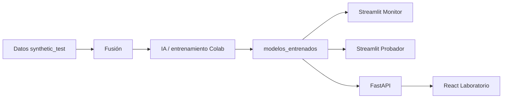

# Arquitectura

```mermaid
flowchart LR
 A[Datos synthetic_test] --> B[Fusión] --> C[IA / entrenamiento Colab]
 C --> D[modelos_entrenados]
 D --> E[Streamlit Monitor]
 D --> F[Streamlit Probador]
 D --> G[FastAPI]
 G --> H[React Laboratorio]
```

La prioridad de esta versión es hacer visible el resultado de **cada fase de entrenamiento** antes de disponer de los modelos definitivos.
